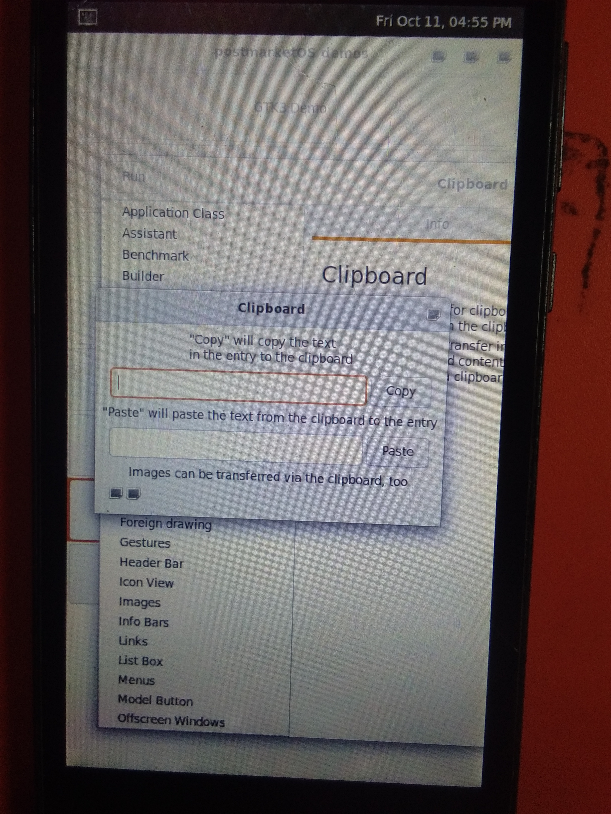

# Intex Aqua Q1 Project

This repository contains work related to **Intex Aqua Q1**, including PostmarketOS and Linux configurations.

## Directory Structure

- **device-intex-q1**: Device-specific configurations for Intex Aqua Q1.
- **linux-intex-q1**: Kernel and Linux configurations for Intex Aqua Q1.
- **images**: Screenshots of the system booting PostmarketOS on Intex Aqua Q1.

## Screenshots
Here are some screenshots from the images folder:

## Instructions from the PostmarketOS Wiki

For instructions on how to set up and configure PostmarketOS on the Intex Aqua Q1, please refer to the official Wiki:

[PostmarketOS Wiki: Intex Aqua Q1](https://wiki.postmarketos.org/wiki/Intex_Aqua_Q1)

Kernel Sources: https://github.com/peremen/kernel-samsung-kiran/

### Quick Setup

To quickly set up your device, follow these steps:

1. Flash the latest PostmarketOS image for Intex Aqua Q1.
2. Configure the kernel and device-specific settings as shown in the `device-intex-q1` and `linux-intex-q1` folders.
3. For detailed instructions, follow the steps in the official Wiki linked above.
